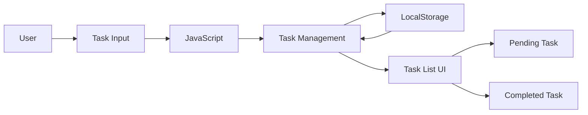

# TaskFlow — Smart Personal Task Manager

> A lightweight and responsive web-based task manager for creating, tracking, completing, and organizing daily tasks.

## Overview

**TaskFlow** is a simple personal productivity application built with HTML, CSS, and JavaScript.

It allows users to create daily tasks, mark tasks as completed, and remove tasks. Task data is stored locally in the browser using **LocalStorage**, so tasks remain available after refreshing the page.

The project focuses on implementing core frontend concepts such as DOM manipulation, event handling, browser storage, dynamic rendering, and responsive UI design.

---

## Problem Statement

Managing daily tasks using notebooks or scattered notes can make it difficult to keep track of completed and pending work.

A simple digital task manager can provide:

* Quick task creation
* Clear pending/completed status
* Easy task removal
* Persistent browser storage
* A simple productivity-focused interface

---

## Solution

TaskFlow provides a centralized interface for managing daily tasks.

### Workflow

```text
Enter Task
    ↓
Add Task
    ↓
Store in LocalStorage
    ↓
Display Task
    ↓
 ┌───────────────┐
 │               │
Pending        Completed
 │               │
 ↓               ↓
Delete        Track Status
```

---

## Features

### 📝 Add Tasks

Users can enter a task and add it to their task list.

### ✅ Complete Tasks

Tasks can be marked as completed and visually distinguished from pending tasks.

### 🗑️ Delete Tasks

Unnecessary tasks can be removed from the list.

### 💾 Persistent Storage

Tasks are stored using the browser's **LocalStorage API**, allowing them to remain available after page refreshes.

### ⚡ Lightweight

The application does not require a backend, database, framework, or external API.

### 📱 Responsive Foundation

The interface uses a centered layout and flexible elements that can be extended for different screen sizes.

---

## Technology Stack

| Technology   | Purpose                                |
| ------------ | -------------------------------------- |
| HTML5        | Application structure                  |
| CSS3         | Styling and layout                     |
| JavaScript   | Application logic and DOM manipulation |
| LocalStorage | Persistent client-side task storage    |

---

## Application Architecture



---

## How It Works

### 1. Create a Task

The user enters a task in the input field.

### 2. Validate Input

The application checks whether the input contains valid text.

### 3. Store Task

The task is stored in the browser's LocalStorage.

Each task contains:

```javascript
{
  name: "Complete assignment",
  status: "pending"
}
```

### 4. Display Tasks

JavaScript reads the stored tasks and dynamically generates the task elements.

### 5. Update Status

When a task is completed, its status changes from:

```text
pending → done
```

### 6. Delete Task

The selected task is removed from the stored task collection and the interface is refreshed.

---

## Project Structure

```text
TaskFlow/
│
├── index.html
└── README.md
```

The current implementation keeps the HTML, CSS, and JavaScript together in `index.html`.

---

## Getting Started

### Clone the Repository

```bash
git clone https://github.com/vasanth-1208/TaskFlow.git
cd TaskFlow
```

### Run the Application

No installation or backend server is required.

Simply open:

```text
index.html
```

in a modern web browser.

For development, you can also use a local development server such as VS Code Live Server.

---

## Data Storage

TaskFlow uses browser LocalStorage rather than a traditional database.

```text
Browser
   ↓
LocalStorage
   ↓
tasks
   ↓
JSON Task Collection
```

This means task information is stored locally on the user's device and is not synchronized between browsers or devices.

---

## Current Limitations

The current version is intentionally lightweight.

* No user authentication
* No cloud database
* No cross-device synchronization
* No task deadlines
* No categories or priorities
* No backend API
* No multi-user support

---

## Future Enhancements

### 📅 Task Scheduling

Add:

* Due dates
* Start dates
* Reminders
* Calendar integration

### 🎯 Task Priorities

Support:

* Low
* Medium
* High
* Urgent

### 🏷️ Categories

Allow users to organize tasks into categories such as:

```text
College
Work
Personal
Projects
Other
```

### 🔎 Search & Filtering

Add filtering by:

* All
* Pending
* Completed
* Priority
* Category

### 📊 Productivity Dashboard

Introduce statistics such as:

```text
Total Tasks
Completed Tasks
Pending Tasks
Completion Rate
```

### ✏️ Edit Tasks

Allow users to modify existing tasks instead of deleting and recreating them.

### 🌙 Theme Support

Add dark and light themes with preference persistence.

### ☁️ Cloud Synchronization

A future full-stack version could use:

```text
Frontend
   ↓
REST API
   ↓
Backend
   ↓
Database
```

to enable authentication and cross-device synchronization.

---

## Learning Outcomes

This project demonstrates practical understanding of:

* HTML structure
* CSS styling
* JavaScript fundamentals
* DOM manipulation
* Event handling
* Array operations
* JSON serialization
* LocalStorage
* Dynamic UI rendering
* Client-side state management

---

## Project Status

**Completed — Frontend Task Management Application**

The current version implements the core task-management workflow using browser-based storage.

Future versions can evolve the project into a complete productivity platform with authentication, cloud synchronization, analytics, scheduling, and collaboration.

---

## Author

**Vasantharaj M**

B.E. Computer Science and Engineering
Bannari Amman Institute of Technology

GitHub: `vasanth-1208`

---

## License

This project is maintained as an educational and personal development project.
